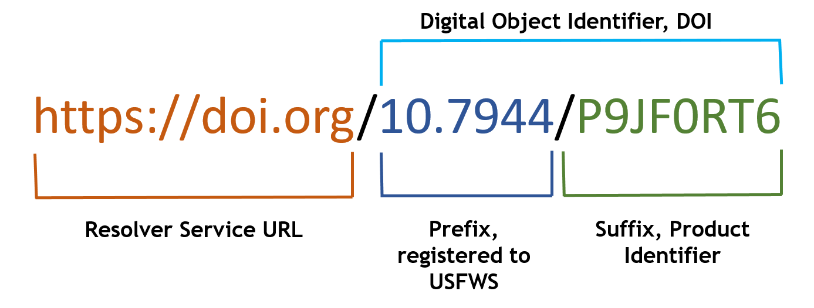

# Obtaining a Digital Object Identifier (DOI)

A digital object identifier (DOI; [www.doi.org](https://www.doi.org)) is a unique identifier permanently associated with a data resource (csv file, report, published paper, etc.). For example, below is the DOI for this guide.&#x20;

The [FWS DOI Tool](https://www1.usgs.gov/fws/doi/) allows you to manage DOIs and associate metadata with them. When you 'click' on a DOI link or enter the link directly at www.doi.org, you are redirected to the website given in the resource's metadata. The main advantage of a DOI is that if the underlying web link changes, you just have to update the DOI metadata.&#x20;


Do not create a DOI for published journal articles or anything else that already has a DOI.  Use the existing DOI assigned by the publisher.



When you create a DOI, you or someone in your organization is responsible for maintaining them. Whenever the metadata for the resource changes, you must update that information using the FWS DOI tool.&#x20;


To reserve a DOI for a product, all you need is the title of the product and the FWS office or program responsible for managing the product. You should use the same title as is in your metadata record for the product. Before you begin, please note that you should not create fake or test DOIs.


Do not create fake or test DOIs!


To reserve a DOI, follow these steps:&#x20;

1. Go to the [FWS DOI Tool](https://www1.usgs.gov/fws/doi/)
2. Read the text in the 'New User?' box.&#x20;
3. Sign in using your Active Directory username and password&#x20;
4. Click the 'Create DOI' button
5. Enter the title and select your program
6. Click 'Reserve my DOI'&#x20;
7. Select 'Add Manager'
8. Enter the name of a secondary person that will manage this DOI in your absence. You should enter the Data Custodian for your program. You may also add others, if appropriate. The Active Directory search is slow and often fails, please be patient. After it fails, you can directly enter the person's FWS email.&#x20;


Add the Data Custodian for your program as a secondary person who will manage the DOI.


You now have a DOI reserved for the product. You can save that information and return later or add more information to finish the record and publish the DOI. To finish the record, follow these steps:

1. Login, navigate to your record, and select the 'Required Information' tab on the left.
2. &#x20;Add the following information:
   1. publication year,&#x20;
   2. author contacts (individual or organizational),&#x20;
   3. URL of the product, and
   4. select a resource type from the drop down list.&#x20;
3. (optional) Navigate to the 'Supplemental Information' tab and enter any additional information there.&#x20;
4. At this point you can save the record for publishing later by selecting 'Save unpublished record' on the left or you can publish the record by selecting 'Publish Approved Record to DataCite.' If your record has been approved, select the latter.
5. A confirmation box titled 'Publish DOI?' will appear. To confirm and publish the DOI, select 'YES, publish this DOI'.

The information is then sent to [DataCite](https://datacite.org) where the DOI is published. When someone enters the DOI link into a web browser, they are redirected to the URL you provided in the metadata.  Usually after a few minutes (it could be up 24 hours), you should be able to locate your data product by entering the DOI at [www.doi.org](https://www.doi.org). If it does not work after 24 hours or you have any other problems, contact the [FWS DOI Tool Service Desk](https://my.usgs.gov/jira/servicedesk/customer/portal/32/create/455).&#x20;


Currently there is no official Region-wide approval process for obtaining DOIs and publishing data products. You should seek the approval of the Data Steward, Project Manager (PI), and your Supervisor.&#x20;

